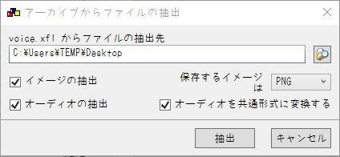
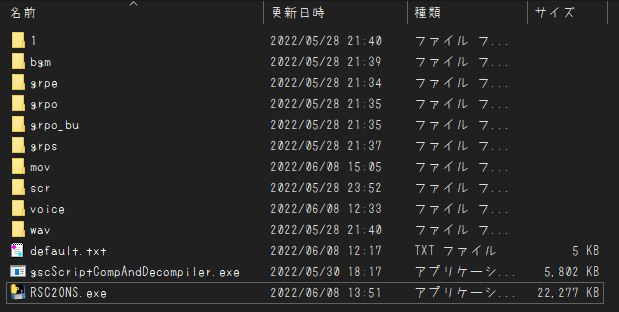

# RSC2ONS_Liar-SB
## なにこれ
  2005年にLiar-soft様から発売された、18禁PC向けノベルゲーム'[SEVEN-BRIDGE](https://www.liar.co.jp/seven.html)'を 
  ONScripter形式へ変換するためのコンバータです 

## 再現度
原作との違いは主に以下
 - 立ち絵や背景にそこそこ表示/削除ミスあり
 - 背景変化時の暗転を挟む処理が行われない
 - 大多数の画像遷移は単純なフェードで代用
 - セピア/モノクロ/色反転処理一切なし
 - 一部音声が鳴らない/消えない
 - セーブ/ロード画面は超簡略化
 - 立ち絵はすべて瞬間表示
 - CG/回想モードは未実装

演出周りを中心にかなりの処理を端折っています 
"読む分には支障はない"といったレベルで、 
再現度はかなり低めです　ご了承下さい 

## 使い方
 1. 適当な作業フォルダを作成
 2. [GARBro](https://drive.google.com/file/d/1gH9nNRxaz8GexN0B1hWyUc3o692bkWXX/view)で以下のxflを(同名のディレクトリを作成した上で)作業フォルダへ展開 
    
     - wav.xfl
     - voice.xfl
     - scr.xfl
     - grps.xfl
     - grpo_bu.xfl
     - grpo.xfl
     - grpe.xfl
     - bgm.xfl

     (grpo_ex.xflは今回利用しません) 
     設定は以下の通り↓ 
     
 3. voice内に"1.xfl"というファイルがあるので同様に作業フォルダへ展開 
    (展開後は削除してOK)
 4. [gscScriptCompAndDecompiler-cli](https://github.com/PC-CNT/gscScriptCompAndDecompiler-cli/releases/tag/pr12)をDLし作業フォルダへ移動 
 5. 展開先のディレクトリで[このコンバータ](https://github.com/Prince-of-sea/RSC2ONS_Liar-SB/releases/latest)をDL/起動させ変換(最低でも数分程度はかかります) 
    変換前の時点で以下のような構成になっていればOKです↓ 
     
 6. ウィンドウが消え、0.txtができれば完成 
    exe等の不要データを削除し、変換済みファイルと共に利用ハードへ転送

## 注意事項
 - 当然ですが公式ツールではありません
 - __FANZA DL版で動作確認しています__ パッケージ版の動作は未確認
 - 本ツールの使用において生じた問題や不利益などについて、作者は一切の責任を負いません

## その他
本作の変換を追加でサポートする[PSP向け自動変換ツール作ってます](https://github.com/Prince-of-sea/ONScripter_Multi_Converter) 
もしPSPで遊ぶ場合はぜひご利用ください(v1.2.7以上推奨)
